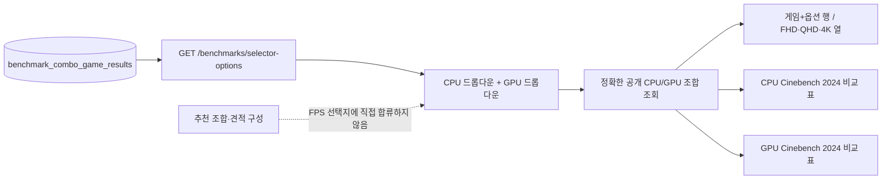
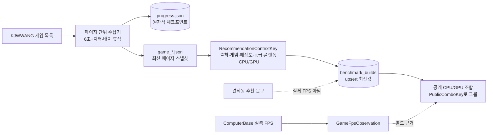

# 부품 벤치마크 비교 흐름 아키텍처 보고서

작성일: 2026-09-10
관련 Wayfinder: #63
관련 ADR: [ADR-015](../adr/0015-component-benchmark-observations-and-comparison.md)

## 점검 범위

이번 다중 티켓 작업의 수집·저장·집계·표시 흐름을 점검했다. 목표는 각 호출자가
외부 HTML 구조나 원본 출처 정책을 직접 알지 않아도, 같은 테스트 조건의 점수를
안전하게 비교할 수 있는 깊은 모듈(seam)을 유지하는 것이다.

## 현재 흐름

```mermaid
flowchart LR
  A[ComputerBase 차트] --> B[Agent 수집기\n원본 행·조건·URL]
  B --> C[(benchmark_component_observations\nimmutable observation)]
  C --> D[ComponentBenchmarksService\n모델군 매칭·대표값·delta]
  D --> E[GET /benchmarks/components/*]
  E --> F[BenchmarkScoreComparison\nCPU/GPU 분리 카드·막대]
  F --> G[/benchmarks]
  F --> H[/quote·견적 상세]

  I[parts 표준 부품] --> D
  J[benchmark_component_tests\n버전·지표·단위·비교군] --> D
  K[benchmark_sources\n출처 provenance] --> D
  L[GameRecommendationCombo] -. 분리 유지 .-> M[GameFpsObservation]
  N[KJWWANG RecommendationContextSnapshot] --> O[GET /benchmarks/recommendation-combos]
  O --> P[RecommendationComboGroup\nCPU/GPU 집계·상세 맥락]
  P --> Q[/benchmarks 추천 조합 영역]
  P -. FPS 아님 .-> M
```

### FPS 선택형 화면 흐름



선택지는 실제 FPS 근거 조합에서만 생성한다. 추천 조합 수가 많더라도 해당 조합에
해상도·옵션·숫자 FPS가 없으면 선택기에 넣지 않으며, 빈 해상도 셀을 다른 값으로
복제하지 않는다.

### 견적왕 느린 증분 수집 흐름



수집기와 DB 동기화기는 서로 다른 seam을 가진다. 수집기는 요청 속도·재시도·조건부
요청·중단 후 재개를 책임지고, 동기화기는 출처 맥락별 최신값과 중복 제거를 책임진다.
따라서 견적왕의 추천 조합이 존재한다는 사실을 실제 FPS 관측값으로 승격하지 않는다.
`progress.json`은 임시 파일을 먼저 쓴 뒤 `rename`하여 중단 중에도 직전 체크포인트를
보존한다. 공개 화면에서는 동일 CPU/GPU를 한 조합으로 묶되, 내부에는 게임·해상도·
등급별 추천 맥락을 유지한다.

## 모듈과 seam

| 모듈 | 외부 인터페이스 | 내부에 숨기는 복잡성 | 검증 seam |
|---|---|---|---|
| ComputerBase 수집기 | HTML → 관측 레코드 배열, `--apply` 동기화 | 차트 선택, 행 조건 추출, 날짜 버전, 모델군 정규화, 중복·기사 스냅샷 교체 | parser test + dry-run |
| `ComponentBenchmarksService` | `getScores(partId)`, `compare(partIds, testId?)` | SQL 조회, SKU가 다른 동일 모델군 연결, evidence/test group 필터, median과 delta | fake `DataSource` service test |
| `component-benchmark.ts` | 순수 정규화·비교·대표값 함수 | 정렬·중앙값·비교 가능성 규칙 | unit test |
| `BenchmarkScoreComparison` | 비교 응답 → 반응형 화면 | CPU/GPU 분리, 카드/막대, 긴 이름·URL 줄바꿈, provenance 접기 | typecheck + browser smoke |
| `BenchmarksService` 추천 조합 API | 견적왕 스냅샷 → 공개 조합 그룹·상세 맥락 | 출처 고정, CPU/GPU 집계, 게임·해상도·등급 보존, FPS 흐름과 분리 | service/controller test + API smoke |
| `/benchmarks` 추천 조합 영역 | API 응답 → JHS 추천 맥락 카드 | FPS 영역과 선택 상태 분리, 긴 텍스트·URL의 반응형 표시 | typecheck + browser smoke |

## 깊이 평가

- 수집기는 외부 HTML 변경을 API/UI로 전파하지 않는 충분한 깊이를 가진다.
- 비교 서비스는 현재 API 호출자가 SQL과 모델군 규칙을 알 필요 없게 하므로 깊이가
  있다. 비교 규칙은 순수 모듈로 분리되어 테스트가 빠르다.
- 화면은 비교 응답의 공개 계약만 소비하며 견적 화면과 벤치마크 화면이 같은
  인터페이스를 공유한다.
- `GameRecommendationCombo`와 `GameFpsObservation`을 별도 흐름으로 유지해,
  추천 조합의 존재를 FPS 실측값으로 오해하는 얕은 우회로를 막는다.

## 선택한 유지보수 기회

Agent와 서버가 모델군 정규화 규칙을 각각 구현하고 있다. 현재는 수집기 실행을
서버 배포와 독립시키는 이점이 더 크므로 즉시 공통 패키지로 합치지 않는다.
다음 정규화 규칙 변경이 필요해질 때 두 구현을 함께 계약 테스트로 고정한 뒤,
공유 모듈로 깊게 만드는 것을 후속 아키텍처 티켓으로 삼는다. 이번 작업에서는
그 경계를 변경하지 않고 동일한 정규화 규칙과 테스트 사례를 유지한다.

## 검증 결과

- DB migration은 additive 방식으로 적용되며 기존 게임 FPS 테이블과 분리된다.
- ComputerBase 수집기는 dry-run에서 Cinebench 2024 32행, Cinebench R23 92행,
  Time Spy Graphics 116행, Fire Strike Overall 16행을 확인했고 dev DB에 같은
  원본 관측값을 저장했다. 출처 차트가 공개하지 않은 시스템·OS·드라이버 값은
  `unavailableConditionFields`로 남긴다.
- 비교 API는 테스트·버전·지표·대상·단위가 다른 점수를 같은 그룹으로 합치지 않는다.
- `PART_ID`가 없는 모호한 모델군 관측값은 공개 비교에서 제외하고, 추천 조합도
  벤치마크가 실제로 연결된 유일한 표준 부품일 때만 ID를 전달한다.
- `/benchmarks`에서 CPU와 GPU 비교 패널이 분리되고, 견적 상세는 같은 공용
  컴포넌트를 사용한다.
- 이번 검증 실행에서는 견적왕 증분 수집으로 2개 페이지를 페이지 사이 6초 이상
  간격으로 처리했고, dev DB에는
  동일 출처의 원본 2,099개 추천 스냅샷을 최신값 정책으로 반영했다. 이 중 추천
  맥락 필드가 완전한 2,098개를 API가 72개 공개 CPU/GPU 조합으로 집계하며,
  맥락 필드가 없는 레거시 1건은 제외한다.
  전체 160개 게임 페이지는 기본 10개 배치로 계속 이어서 수집한다.
- 견적왕 추천 조합 API는 `recommendationCount`·`gameCount`·`latestCapturedAt`과
  원본 URL을 제공하며, 실제 FPS 결과 API와 별도 경계로 동작한다. 로컬 API smoke에서
  `total=72`, 첫 조합 상세 `315개 맥락`, FPS 필드 미포함을 확인했다.

## QA 기록

- 로컬 `/benchmarks` 브라우저 smoke에서 CPU/GPU 비교 패널 분리, 긴 부품명 줄바꿈,
  provenance 접기, 해상도별 FPS 값 분리를 확인했다.
- 비교 UI는 `min-w-0`, `break-words`, `break-all`과 반응형 카드 레이아웃을 사용해
  모바일 폭에서도 콘텐츠가 부모를 밀어내지 않도록 구성했다. 이번 검증에서는 별도
  모바일 기기 에뮬레이션 스크린샷까지는 수행하지 않았으므로, 특정 기기 픽셀 단위
  회귀 검증은 후속 QA 항목으로 남긴다.
