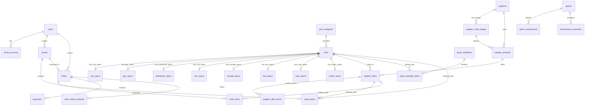

# DB 설계
> 최초 작성: 2026-05-23
> 최신 수정: 2026-05-30
> DB: MySQL / ORM: TypeORM

---

## 기준 문서

- 상세 컬럼 정의서는 [DB_TABLE_DEFINITION.md](DB_TABLE_DEFINITION.md)를 기준으로 한다.
- 이 문서는 ERD, 설계 원칙, 결정 이유를 기록한다.

---

## 명명 규칙

| 항목 | 규칙 |
|---|---|
| 테이블명 | `TB_` 접두사 없이 `snake_case` 복수형 |
| 예시 | `users`, `parts`, `supplier_products`, `supplier_offers` |
| PK | 각 테이블 의미를 드러내는 `*_ID` 컬럼 |
| 시간 컬럼 | `CREATED_DT`, `UPDATED_DT` |
| 활성 여부 | `IS_ACTIVE` 값은 `Y`/`N` |
| 상태값 | DB는 `VARCHAR`, 애플리케이션 enum으로 검증 |

---

## 설계 원칙

- 견적은 계속 최신 가격을 반영하는 **live 데이터**다.
- 주문은 주문 시점의 부품/가격/배송정보를 보존하는 **snapshot 데이터**다.
- 공급처 상품명은 표준 부품명과 다를 수 있으므로 표준 부품과 공급처 상품을 분리한다.
- 실제 구매 가능한 단위는 `supplier_offers`로 통일한다.
- 컴퓨존 `ProductNo`, 다나와 `pcode`는 `supplier_products.external_product_id`에 저장하고 `supplier_id + external_product_id`로 구분한다.
- 호환성 판단에 필요한 스펙은 수집 JSON/상품 원본 JSON을 참고해 관리자 검수 후 정규화한다.
- MVP에서는 딜러 할인가/마진 계산 테이블을 만들지 않는다. 추후 실제 매입가/마진 이력으로 확장한다.

---

## 핵심 ERD

---

## 핵심 테이블 그룹

| 그룹 | 테이블 | 역할 |
|---|---|---|
| 사용자 | `users`, `social_accounts` | 회원과 카카오/네이버/구글 소셜 계정 분리 |
| 표준 부품 | `part_categories`, `parts` | 견적에 들어가는 내부 기준 부품 |
| 공급처 | `suppliers`, `supplier_crawl_targets`, `supplier_products`, `supplier_offers`, `supplier_offer_prices` | 컴퓨존/다나와 상품과 실제 판매 단위 관리 |
| 스펙 | 카테고리별 `*_specs` | 호환성용 정규화 스펙 |
| 견적 | `quote_templates`, `quote_template_items`, `quotes`, `quote_items` | 자동 견적과 현재 선택 부품 |
| 검증 | `orders.PRICE_CHECK_*`, 백엔드 호환성 계산 | 주문 직전 가격 확인과 호환성 검증 |
| 주문 | `orders`, `order_items`, `payments`, `order_status_histories` | 주문 스냅샷, 입금, 상태 이력 |
| 성능 | `games`, `game_requirements`, `performance_estimates` | 게임별 등급/FPS 범위 |

---

## 표준 부품과 판매 단위

### parts

`parts`는 쇼핑몰 상품 페이지가 아니라 **견적에 들어가는 표준 부품**이다.

예시:

| PART_ID | CATEGORY | CANONICAL_NAME |
|---:|---|---|
| 1001 | CPU | AMD 라이젠7 7800X3D |
| 2001 | GPU | MSI 지포스 RTX 5060 벤투스 2X OC D7 8GB |
| 3001 | SSD | 삼성전자 990 EVO Plus 1TB |

### supplier_products

`supplier_products`는 공급처의 상품 페이지/대표 상품이다.

예시:

| SUPPLIER | EXTERNAL_PRODUCT_ID | PRODUCT_NAME |
|---|---|---|
| compuzone | 1013843 | [AMD] 라이젠7 라파엘 7800X3D ... |
| danawa | 70531547 | AMD 라이젠7 9800X3D 멀티팩 정품 |

### supplier_offers

`supplier_offers`는 실제 구매 가능한 판매 단위다. 견적/주문/가격은 최종적으로 이 테이블을 바라본다.

예시:

| OFFER_NAME | PACKAGE_TYPE | COOLER_INCLUDED | PART |
|---|---|---|---|
| [AMD] 라이젠7 9800X3D [멀티팩] | MULTIPACK | N | AMD 라이젠7 9800X3D |
| [AMD] 라이젠7 9800X3D [정품박스] | BOX | Y/N | AMD 라이젠7 9800X3D |
| 삼성전자 990 EVO Plus [1TB] | CAPACITY |  | 삼성전자 990 EVO Plus 1TB |

---

## 부품 분리 규칙

| 상황 | 처리 |
|---|---|
| CPU 멀티팩/정품박스/벌크 | 같은 CPU 실리콘과 동일 스펙이면 같은 `parts`, 판매 차이는 `supplier_offers` |
| CPU 쿨러 포함 여부 | CPU 기술 스펙이 아니라 `supplier_offers.cooler_included` |
| RAM/SSD 용량 차이 | 견적 선택 조건이 달라지므로 다른 `parts` |
| PSU 와트 차이 | 다른 `parts` |
| 케이스/쿨러 색상 차이 | MVP에서는 다른 `parts` |
| 해외구매/병행수입 | 기본 자동 견적에서는 제외, 관리자 승인 시 허용 가능 |

---

## CPU 판매 패키지 선택 규칙

| 상황 | 선택 규칙 |
|---|---|
| 견적에 별도 CPU 쿨러가 포함됨 | 멀티팩/정품박스/벌크 중 재고 있고 관리자 승인된 최저가 판매 단위 선택 |
| 견적에 별도 CPU 쿨러가 없음 | `COOLER_INCLUDED = Y`인 정품박스/쿨러 포함 패키지 우선 |
| 기본 쿨러도 없고 별도 쿨러도 없음 | 자동 견적에서 CPU 쿨러 추가 또는 관리자 검토 |
| 해외구매/비공식 유통 | MVP 자동 견적 기본 제외 |

---

## 스펙 저장 전략

외부 스펙은 바로 정답으로 쓰지 않는다. 다만 MVP DB에는 원본 스펙 전용 테이블을 두지 않는다.

1. 크롤러는 원본 HTML/JSON을 파일로 저장한다.
2. DB에는 필요 시 `supplier_products.RAW_SPEC_JSON` 정도만 저장한다.
3. 백엔드 파서가 호환성에 필요한 핵심 필드만 카테고리별 정규화 스펙 테이블에 반영한다.
4. 관리자 검수 후 `parts.SPEC_STATUS = ADMIN_VERIFIED`로 바꾼다.

MVP 정규화 대상:

| 테이블 | 핵심 필드 |
|---|---|
| `cpu_specs` | socket, core_count, thread_count, base_clock_mhz, boost_clock_mhz, tdp_w, memory_types_json, integrated_graphics |
| `gpu_specs` | chipset_manufacturer, gpu_model, memory_gb, length_mm, recommended_psu_w, power_w, power_connectors_json |
| `mainboard_specs` | socket, chipset, memory_type, form_factor, m2_slot_count |
| `ram_specs` | memory_type, capacity_gb, module_count, speed_mhz |
| `storage_specs` | storage_type, capacity_gb, interface_type, form_factor |
| `psu_specs` | wattage, form_factor, efficiency_rating |
| `case_specs` | case_type, supported_board_forms_json, max_gpu_length_mm, max_cooler_height_mm |
| `cooler_specs` | cooler_type, supported_sockets_json, height_mm, radiator_size_mm |

---

## 매칭 전략

컴퓨존 상품명과 다나와 상품명은 표기가 다르기 때문에 자동 매칭 결과를 확정값으로 보지 않는다.

매칭 점수 후보:

| 기준 | 예시 |
|---|---|
| 제조사 일치 | MSI, AMD, Intel |
| 모델 키 일치 | 9800X3D, RTX 5060, B650M-P |
| 카테고리 일치 | CPU/GPU/MAINBOARD |
| 핵심 스펙 일치 | 소켓, 칩셋, 용량, 와트 |
| 패키지/용량/색상 일치 | 멀티팩, 정품, 1TB, WHITE |
| 금지어/차이점 | 해외구매, 병행수입, 리퍼, 벌크 |

매칭 후보는 백엔드 스크립트/관리자 화면에서 계산하고, 확정 결과만 `supplier_offers.PART_ID`에 저장한다.

---

## 가격 전략

- 가격 이력은 `supplier_offer_prices`에 저장한다.
- 고객 노출 기준 가격은 컴퓨존 일반가를 우선한다.
- 주문 직전에는 견적에 포함된 `supplier_offers`만 다시 확인한다.
- 가격이 1원이라도 바뀌면 `orders.PRICE_CHECK_STATUS = CHANGED`와 `orders.PRICE_CHANGE_JSON`으로 현재 승인 대상만 저장한다.
- 품절/재고부족 부품은 자동 견적에서 제외하고, 가능한 경우 대체 부품을 추천한다.

---

## 견적/주문 전략

### quotes

- 견적은 삭제/파기하지 않고 최신 가격을 반영한다.
- 사용자가 주문하기 전까지의 부품 변경 이력은 MVP에서 별도 저장하지 않는다.
- `quote_items`는 현재 선택된 `parts`와 `supplier_offer_id`를 가진다.

### orders

- 주문은 주문 시점의 가격, 부품명, 공급처 코드, 판매 단위명을 `order_items`에 스냅샷으로 저장한다.
- 주문 직전 가격 확인 결과는 `orders.PRICE_CHECK_STATUS`, `PRICE_CHECKED_DT`, `PRICE_CHANGE_JSON`, `PRICE_APPROVED_DT`로 관리한다.
- 배송 정보는 주문하기 시점에 받는다.
- MVP 결제는 계좌이체이며, `payments`는 입금 확인 상태를 관리한다.

주문 상태 후보:

| 상태 | 의미 |
|---|---|
| PRICE_APPROVAL_REQUIRED | 가격 변경 승인 대기 |
| ADMIN_REVIEW | 관리자 검토 |
| WAITING_DEPOSIT | 입금 대기 |
| DEPOSIT_CONFIRMED | 입금 확인 |
| PARTS_ORDERING | 부품 주문 중 |
| PARTS_WAITING | 부품 도착 대기 |
| PARTS_ARRIVED | 부품 도착 완료 |
| ASSEMBLING | 조립 중 |
| TESTING | 테스트 중 |
| PREPARING_DELIVERY | 배송 준비 |
| SHIPPING | 배송 중 |
| DELIVERED | 배송 완료 |
| PURCHASE_CONFIRMED | 구매 확정 |
| REVIEW_AVAILABLE | 후기 작성 가능 |
| CANCELLED / REFUNDED / ON_HOLD | 취소/환불/보류 |

---

## 결정 사항

- `TB_` 접두사는 사용하지 않는다.
- 표준 부품은 `parts`, 공급처 상품 페이지는 `supplier_products`, 실제 구매 단위는 `supplier_offers`로 분리한다.
- `supplier_offers`가 견적/주문/가격의 기준이다.
- 공급처 카테고리는 우리 서비스 카테고리가 아니라 수집 대상이므로 `supplier_crawl_targets`로 관리한다.
- `raw_spec_sources`, `raw_spec_items`, `part_spec_values`, `quote_histories`, `price_check_logs`, `part_match_candidates`, `crawl_runs`, `crawl_items`, `compatibility_checks`는 MVP 테이블에서 제외한다.
- 실제 호환성 체크는 카테고리별 정규화 스펙 테이블을 기준으로 한다.
- 호환성 체크 결과는 백엔드에서 계산하고, 주문 가능 여부는 `orders.STATUS`와 관리자 검토 상태로 반영한다.
- 주문 상태처럼 고객/운영에 의미 있는 이력만 별도 테이블로 남긴다.
- 마진/딜러가 계산은 MVP 이후로 미룬다.
